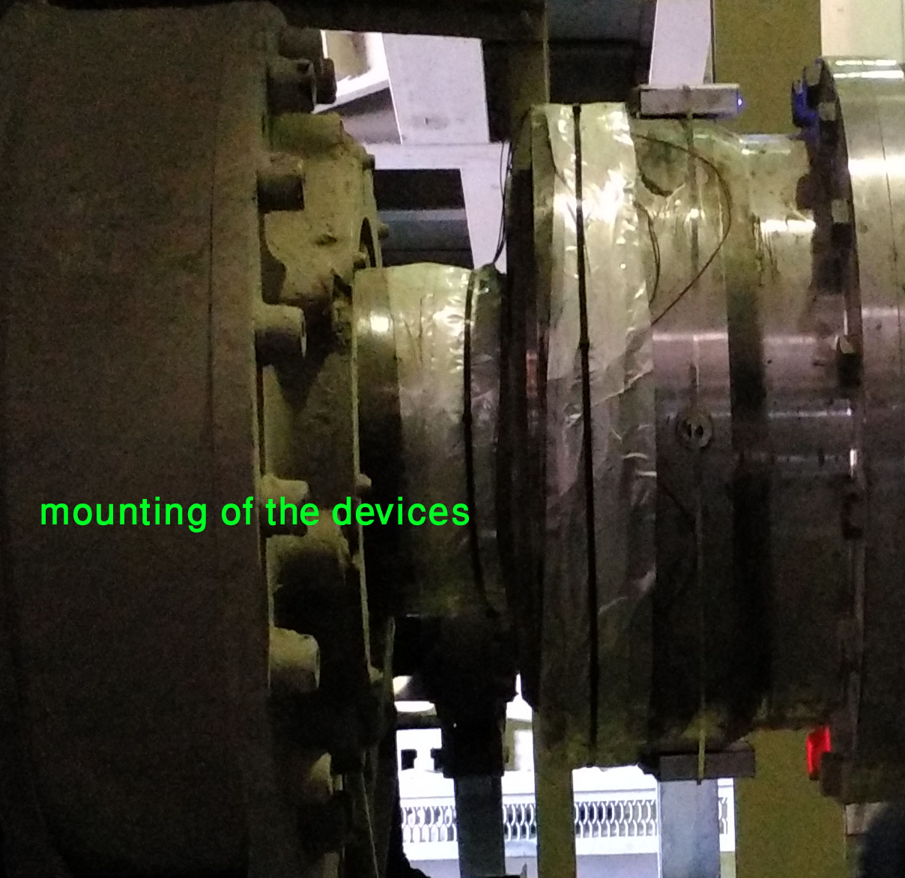
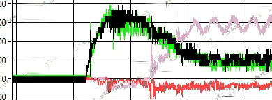

\#industrial #robotic #power_Measurement #Torque_telemetry #power_measurement

##Industrial multi-channel torque telemetry and power monitoring System:

The aim of this project is sending torque data from multi rotary shaft to a stationary location.

####What we need:

- High-resolution data
- High sampling rate
- Data coding for loss prediction
- Torque and Rpm synchronization for best power accuracy
- Low power implementation, due to lack of power on the shaft
- Many torque synchronization

####Why we discover some project data:

Torque and power monitoring are very important in system efficiency evaluation. This device helps understanding the system details.

This project is multi torque synchronized and power monitoring.

###Main system

#####Main measurement system

A microcontroller board measures Torque with strain-gauge. One of important factor is bridge excitation voltage and power off the bridge in the inactive condition.

A true 16-bit measurement is sufficient on the shaft. Our experiment shows a “true” 16-bit bridge measurement is a most important factor in torque on shaft measurement.

#####telemetry system

A telemetry link should not have any loss during data transmission.A good ECC algorithm helps you overcome the lack of data in some periods.

 #####torque and RPM measurement

A real-time power measurement needs torque and shaft RPM. For True power measurement, a time synchronized torque and RPM, multiple to generate power that transfer to load.

###note

Our method works for up to 16 channel synchronous torque with 1 kHz bandwidth. (We don’t check, but I think 10 kHz sample is accessible with minor changes) 

Our method can extend for many strain-gauges that measure torque or force or another sensor.One of my goal for this project is humanoid robot where the robot can measure all the muscle force and give it the opportunity to balance these forces. This helps the robot to sense any forces 

###Test

In one of our tests, we measure 4 channel synchronized torque with 4 channel vibration. This pictures show mounting and a sample data of torque.

the picture below shows one sample of start up of motors.

sample video of torque measurement:

for any details contact with <u>mahdiks AT gmail.com</u>

   

 

 

 

 

 
